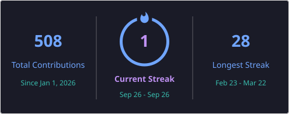

<h1 align="center">Hi 👋, I'm Deepak Chauhan</h1>

<h3 align="center">
Aspiring Full Stack Developer | Gen AI Enthusiast
</h3>

  Building responsive web applications and AI-powered solutions.

---

## 👨‍💻 About Me

- 💻 Aspiring Full Stack Developer
- 🤖 Interested in Generative AI and Agentic AI
- 🚀 I enjoy building responsive and user-friendly applications
- 🌱 Currently improving my Full Stack Development and Gen AI skills

---

## 🛠️ Tech Stack

### Frontend

### Backend

### Database

### AI & Data

---

## 🚀 Featured Projects

### 🤖 Meridian AI

AI-powered Market Research and Strategy Engine.

- Multi-agent research pipeline
- Automated research and evidence extraction
- Source validation and citation generation
- FastAPI backend
- Gemini API integration
- PostgreSQL / Supabase

[View Project](https://github.com/DeepakChauhan33/Meridian-Strategy-Engine)

### 🛒 Storefront Commerce

Full-stack e-commerce application built with React, Node.js, Express and MongoDB.

- Product browsing
- Authentication
- Shopping cart
- Wishlist
- Orders
- Responsive UI

[View Project](https://github.com/DeepakChauhan33/Storefront-Commerce)

---

## 📊 GitHub Stats

---

## 🔥 GitHub Streak

---

## 📫 Connect With Me

---

<b>💻 Keep Building • Keep Learning • Keep Growing 🚀</b>

